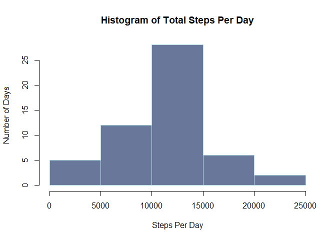
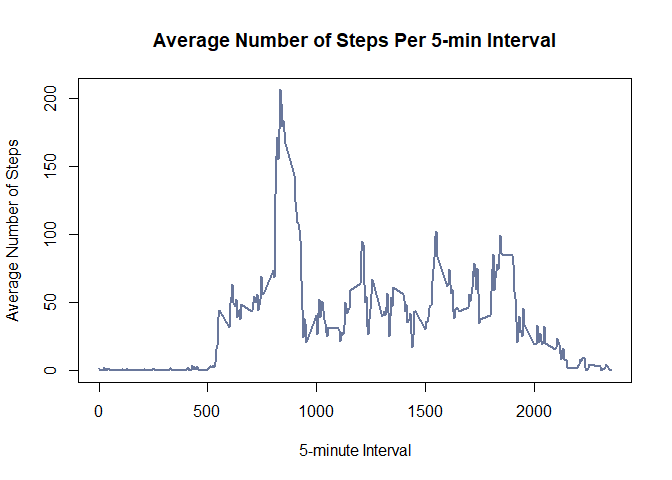
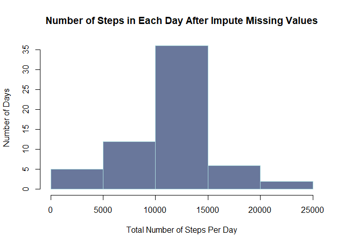
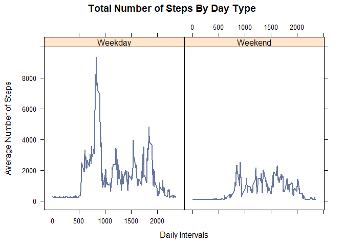

## Loading and preprocessing the data

```r
fileName <- "activity.zip"

unzip(fileName)

activity <- read.csv("activity.csv")

summary(activity)
```

```
##      steps                date          interval     
##  Min.   :  0.00   2012-10-01:  288   Min.   :   0.0  
##  1st Qu.:  0.00   2012-10-02:  288   1st Qu.: 588.8  
##  Median :  0.00   2012-10-03:  288   Median :1177.5  
##  Mean   : 37.38   2012-10-04:  288   Mean   :1177.5  
##  3rd Qu.: 12.00   2012-10-05:  288   3rd Qu.:1766.2  
##  Max.   :806.00   2012-10-06:  288   Max.   :2355.0  
##  NA's   :2304     (Other)   :15840
```

## What is mean total number of steps taken per day?

#### 1. Calculate the total number of steps taken per day.

```r
totalStepsPerDay <- aggregate(steps ~ date, activity, FUN = sum, na.rm = TRUE)
```
#### 2. If you do not understand the difference between a histogram and a barplot, research the difference between them. Make a histogram of the total number of steps taken each day.

```r
hist(totalStepsPerDay$steps
     , main = paste("Histogram of" , "Total Steps Per Day")
     , col = "#69779B"
     , border = "#ACDBDF"
     , xlab = "Steps Per Day"
     , ylab = "Number of Days"
)
```

<!-- -->

#### 3. Calculate and report the mean and median of the total number of steps taken per day.

```r
# The "Mean" of "Total No of Steps Per Day" 
meanStepsPerDay <- mean(totalStepsPerDay$steps)
print(meanStepsPerDay)
```

```
## [1] 10766.19
```

```r
# The "Median" of "Total No of Steps Per Day" 
medianStepsPerDay <- median(totalStepsPerDay$steps)
print(medianStepsPerDay)
```

```
## [1] 10765
```


## What is the average daily activity pattern?

#### 1. Make a time series plot ***(i.e. type = "l")*** of the 5-minute interval (x-axis) and the average number of steps taken, averaged across all days (y-axis).

```r
averageSteps <- aggregate(steps ~ interval, data = activity, FUN = mean, na.rm = TRUE)

plot(steps ~ interval
     , data = averageSteps
     , type = "l"
     , col = "#69779B"
     , lwd = 2
     , main = "Average Number of Steps Per 5-min Interval"
     , xlab = "5-minute Interval"
     , ylab = "Average Number of Steps"
     )
```

<!-- -->

#### 2. Which 5-minute interval, on average across all the days in the dataset, contains the maximum number of steps?.

```r
maxIntervalStepsNo <- averageSteps[which.max(averageSteps$steps),]$interval
print(maxIntervalStepsNo)
```

```
## [1] 835
```


## Imputing missing values

### Note that there are a number of days/intervals where there are missing values (coded as \textcolor{red}{red}**NA**). The presence of missing days may introduce bias into some calculations or summaries of the data.

#### 1. Calculate and report the total number of missing values in the dataset (i.e. the total number of rows with **NAs**).

```r
missingValues<-is.na(activity$steps)
head(missingValues)
```

```
## [1] TRUE TRUE TRUE TRUE TRUE TRUE
```

```r
SumOfMissingValues <- sum(is.na(activity$steps))
print(SumOfMissingValues)
```

```
## [1] 2304
```

#### 2. Devise a strategy for filling in all of the missing values in the dataset. The strategy does not need to be sophisticated. For example, you could use the mean/median for that day, or the mean for that 5-minute interval, etc.

```r
# filling in all of the missing values in the dataset with "Mean" values
missingMean <- mean(averageSteps$steps)
print(missingMean)
```

```
## [1] 37.3826
```

#### 3. Create a new dataset that is equal to the original dataset but with the missing data filled in.

```r
# Cloning "Activity Dataset" to exchange "NAs" with "Mean".
imputedActivity <- activity
imputedActivity[missingValues, 1] <- missingMean

head(imputedActivity)
```

```
##     steps       date interval
## 1 37.3826 2012-10-01        0
## 2 37.3826 2012-10-01        5
## 3 37.3826 2012-10-01       10
## 4 37.3826 2012-10-01       15
## 5 37.3826 2012-10-01       20
## 6 37.3826 2012-10-01       25
```

#### 4. Make a histogram of the total number of steps taken each day and Calculate and report the **mean** and **median** total number of steps taken per day. Do these values differ from the estimates from the first part of the assignment? What is the impact of imputing missing data on the estimates of the total daily number of steps?

```r
totalStepsImputedPerDay <- aggregate(steps ~ date, imputedActivity, sum)

hist(totalStepsImputedPerDay$steps
     , main = "Number of Steps in Each Day After Impute Missing Values"
     , xlab = "Total Number of Steps Per Day"
     , ylab = "Number of Days"
     , col = "#69779B"
     , border = "#ACDBDF"
     )
```

<!-- -->

```r
# The "Mean" of "Total No of Steps Per Day" (After Imputing) 
imputedMean <- mean(totalStepsImputedPerDay$steps)
print(imputedMean)
```

```
## [1] 10766.19
```

```r
# The "Median" of "Total No of Steps Per Day" (After Imputing) 
imputedMedian <- median(totalStepsImputedPerDay$steps)
print(imputedMedian)
```

```
## [1] 10766.19
```


## Are there differences in activity patterns between weekdays and weekends?

### For this part the weekdays()\color{red}{\verb|weekdays()|}weekdays() function may be of some help here. Use the dataset with the filled-in missing values for this part.

#### 1. Create a new factor variable in the dataset with two levels – “weekday” and “weekend” indicating whether a given date is a weekday or weekend day.

```r
imputedActivity$date<-as.Date(imputedActivity$date)
library(dplyr)
```

```
## Warning: package 'dplyr' was built under R version 3.6.2
```

```
## 
## Attaching package: 'dplyr'
```

```
## The following objects are masked from 'package:stats':
## 
##     filter, lag
```

```
## The following objects are masked from 'package:base':
## 
##     intersect, setdiff, setequal, union
```

```r
indecatedActivity <- imputedActivity %>%
    mutate(dayType = ifelse( 
        weekdays(imputedActivity$date) == "Saturday" |
        weekdays(imputedActivity$date) == "Sunday"
        , "Weekend", "Weekday")
        )

head(indecatedActivity)
```

```
##     steps       date interval dayType
## 1 37.3826 2012-10-01        0 Weekday
## 2 37.3826 2012-10-01        5 Weekday
## 3 37.3826 2012-10-01       10 Weekday
## 4 37.3826 2012-10-01       15 Weekday
## 5 37.3826 2012-10-01       20 Weekday
## 6 37.3826 2012-10-01       25 Weekday
```

#### 2. Make a panel plot containing a time series plot (i.e. type = "l) of the 5-minute interval (x-axis) and the average number of steps taken, averaged across all weekday days or weekend days (y-axis). See the README file in the GitHub repository to see an example of what this plot should look like using simulated data.

```r
dayTypeActivity <- indecatedActivity %>%
    group_by(dayType, interval) %>%
    summarize(averageStepsByDay = sum(steps))

head(dayTypeActivity)
```

```
## # A tibble: 6 x 3
## # Groups:   dayType [1]
##   dayType interval averageStepsByDay
##   <chr>      <int>             <dbl>
## 1 Weekday        0              315.
## 2 Weekday        5              242.
## 3 Weekday       10              231.
## 4 Weekday       15              232.
## 5 Weekday       20              228.
## 6 Weekday       25              283.
```

```r
library(lattice)

with(dayTypeActivity,
     xyplot(averageStepsByDay ~ interval | dayType
           , type = "l"
           , main = "Total Number of Steps By Day Type"
           , xlab = "Daily Intervals"
           , ylab = "Average Number of Steps"
           , lwd = 2
           , col = "#69779B"
           )
     )
```

<!-- -->
